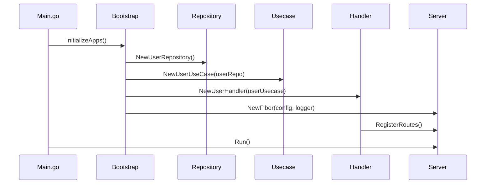

# Booking App

Aplikasi booking sederhana dengan arsitektur clean code dan dependency injection.

## Struktur Folder

```
cmd/
  server/
    main.go           # Entry point aplikasi

internal/
  apps/
    user/
      handler/
        http.go       # HTTP handler untuk user
      repository/
        user_repository.go # Repository user
      usecase/
        user_usecase.go    # Usecase user
  bootstrap/
    wire.go           # Inisialisasi dependency (DI)
  domain/
    user.go           # Domain entity user
  server/
    server.go         # Inisialisasi server Fiber
    middleware/       # Middleware server

pkg/
  config/
    config.go         # Konfigurasi aplikasi
  logger/
    logger.go         # Logger aplikasi
```

## Alur Kerja Aplikasi

1. **main.go**  
   Entry point aplikasi. Memanggil `InitializeApps()` untuk inisialisasi dependency, lalu menjalankan server.

2. **bootstrap/wire.go**  
   Dependency injection: inisialisasi config, logger, repository, usecase, handler, dan server.

3. **Repository**  
   Layer akses data, misal ke database.

4. **Usecase**  
   Bisnis logic, memproses data dari repository.

5. **Handler**  
   HTTP handler, menerima request dan memanggil usecase.

6. **Server**  
   HTTP server (Fiber), menjalankan aplikasi dan menerima request.

## Diagram Alur



## Cara Menjalankan

1. **Clone repository**

   ```sh
   git clone <repo-url>
   cd booking-app
   ```

2. **Install dependencies**

   ```sh
   go mod tidy
   ```

3. **Jalankan aplikasi**
   ```sh
   go run cmd/server/main.go
   ```

## Konfigurasi

- Konfigurasi aplikasi dapat diatur di file `pkg/config/config.go`.
- Logger diatur di `pkg/logger/logger.go`.

## Kontribusi

1. Fork repo ini.
2. Buat branch baru untuk fitur/bugfix.
3. Pull request ke branch utama.

---

**Lisensi:** MIT
